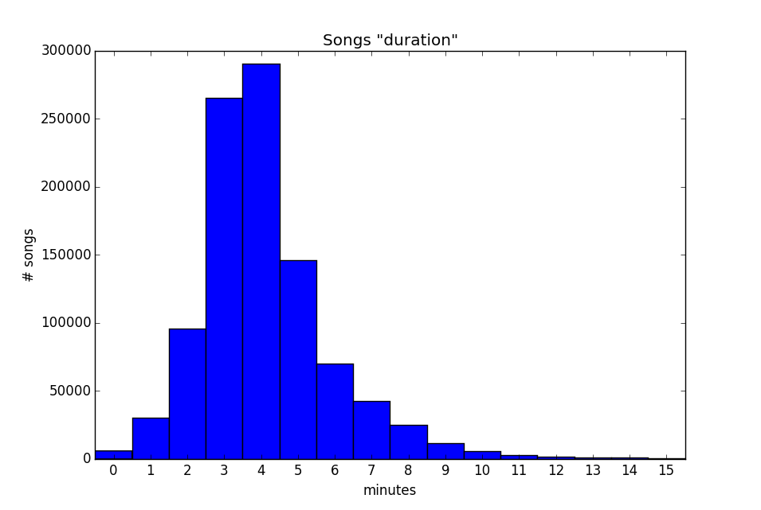

## Duration Cleaning

The script to generate this statistics and graph is duration.py, which is found in
this same folder.

### Basic statistics for the Duration field:

**Mean**: 249.50 seconds   
**Standard Deviation**: 126.23 seconds   
**Median**: 228.86 seconds   
**Maximum**: 3034.91 seconds   
**Minimum**: 0.31 seconds   

The following chart shows the duration of the songs in minutes.

Because the duration of the songs was rounded, 0 minutes means less than 30
seconds, 0 minutes means from 0 (00:00) to 29 (00:29) seconds, 1 minute means
from 30 (00:30) to 89 (01:29) seconds, and so on.

### Negative values
No negative values were found.

### Short duration

5 shortest durations

track_id | duration
-------- | --------
TRDPIXR128E0788EAF | 0.31302
TRIBYKD128F932052E | 0.36526
TRRGYCW128F4228C9D | 0.41751
TRFNQPT128F92F2C10 | 0.41751
TRHHWMY128F4277C38 | 0.44363

These duration values are erroneous, the actual values are:  231, 270, 161, 211, 314. We looked for them, manually, in the Internet.

#### Other statistics
How many songs with a duration less than 5 seconds there are in MSD? 430
How many songs with a duration less than 4 seconds there are in MSD? 303
How many songs with a duration less than 3 seconds there are in MSD? 208
How many songs with a duration less than 2 seconds there are in MSD? 156
How many songs with a duration less than 1 seconds there are in MSD? 85
Most of these values are wrong, but we do not have another database to fix repair this data.

### Long duration

How many songs with a duration of more than 3000 seconds (50 min) there are in MSD? 44
5 longest duration songs:

track_id | duration (sec)
-------- | --------------
TRDZTTO12903CF1A2E | 3034.90567
TRVFVTA128F421E809 | 3033.59955
TRSMLIB128F934C0A8 | 3033.44281
TRPIWVS128F4289D7F | 3032.76363
TRPWIUP128F426B47B | 3032.58077

These 5 times were manually (searching in the Internet) verified and seem to be correct.
So the main problem seems to be in the very short songs. We do not know anything about the other songs duration, but we do not have another database to contrast these values.

## Conclusion

Long duration songs seem to be outliers, but extremely sort duration songs seem to be erroneous data.
Because we do not have another database to compare the values, it is difficult to determine in general what values are wrong due to the verification process is manual.

**Icaro Alzuru**
December - 2015
