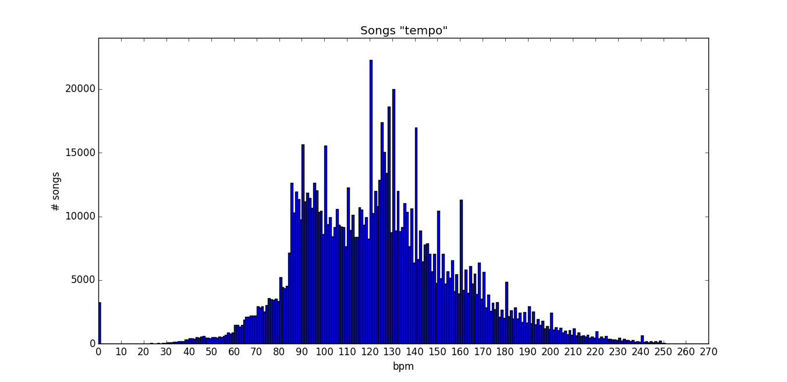

## Tempo Cleaning

The script to generate this statistics and graph is tempo.py, which is found in
this same folder.

In Wikipedia, Tempo is:
> “A piece of music's tempo is typically written at the start of the score, and in modern Western music is usually indicated in beats per minute (BPM). This means that a particular note value (for example, a quarter note, or crotchet) is specified as the beat, and that the amount of time between successive beats is a specified fraction of a minute. The greater the number of beats per minute, the smaller the amount of time between successive beats, and thus faster a piece must be played. For example, a tempo of 60 beats per minute signifies one beat per second, while a tempo of 120 beats per minute is twice as rapid, signifying one beat every 0.5 seconds. ”

A very common tempo (bpm) is 120 (2 beats per second). Based on this, we consider as outliers values less than 20 bpm or greater than 300 bpm.

### Basic statistics for the Tempo field:

**Mean**: 123.89 seconds
**Standard Deviation**: 35.06 seconds
**Median**: 122.09 seconds
**Maximum**: 302.30 seconds
**Minimum**: 0.00 seconds

### High Tempo

The 10 songs with the highest tempo are:

track_id | title | artist_name | tempo
-------- | ----- | ----------- | -----
TRPPDKE128F930D9C0 | Beep Beep | S.T.I.N.K. | 302.300
TRNPTWJ128F93136D2 | Late Nite Lounge: WVIP | Keo Nozari | 296.469
TRFWRVO128F425C4EF | A Place Called Hope | Eric Tingstad/Nancy Rumbel | 285.157
TRBHQUV12903CFAFA9 | Bellas Lullaby - Perrier Citron | Uzeb | 284.208
TRLPHPU12903CD8DAA | Troubled Times | SK Radikals | 282.573
TRRQQTD12903CA2669 | Northern Lady | Saxon | 280.955
TREPXVZ128F425646D | Orpheus In The Underworld: Ov | Discover The Classics | 278.090
TRNWCLV128F426E0B3 | Piano Concerto No. 1 | Lennart Axelsson | 277.747
TRVTGXW128F92FF303 | Jingle bells | Konrad Plaickner | 277.732
TRPTXNI12903CD011F | Skit | Royce Da 5'9 | 277.015

Listening to these songs, we can say they do no have that high tempo. So we believe the data is erroneous for so high tempos.

### Low Tempo

There are 3230 songs with tempo 0 (which is erroneous or unknown).

10 songs with the lowest tempo:

track_id | title | artist_name | tempo | duration
-------- | ----- | ----------- | ----- | --------
TRAHEJP128F930F4C5 | Friends (Demo) | YDI | 7.362 | 33.04
TRFKMZY128F42512C3 | Bore Dome | Jenny Piccolo | 7.604 | 26.51
TRRUMJC128F425CD1A | I Will Trust [Intro] (Album Version) | Damita | 7.672 | 18.78
TRQKAXO128F934FFF3 | 4 | Quickspace | 7.971 | 32.86
TRLWBAX128F92C83AE | Walking Distance - Finale | Bernard Herrmann | 8.797 | 75.96
TRWWHFN128F92EB50E | Fous qui disiez | Michael Mantler_ Jack Bruce_ Marianne Faithful... | 8.830 | 23.27
TRGXUIJ128F932D572 | Wouldn't You Agree | Ec8or | 8.903 | 28.39
TRTSTDH12903CDFB5C | Odies Revenge | Unseen Terror | 9.604 | 15.93
TRATQGY12903D03660 | 1 Trick Pony | Kid Carpet | 9.940 | 21.16
TRUREGB128F933D146 | Together | Negative FX & Last Rights | 10.079 | 34.40

We checked manually these songs and the low tempo is erroneous. In almost all cases they are Intros with a lot of noise. We do not know how the original data was generated but the process seems to have problems with this kind of song. Because of that, we included the duration is the previous table.

The following chart shows the number of songs per tempo.

In the center of the image, there are peaks for 80, 90, 100, 110, and so on bpm.

**Icaro Alzuru**
December - 2015
